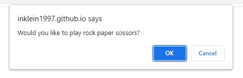
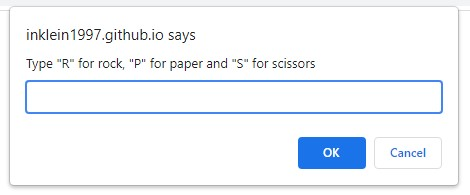
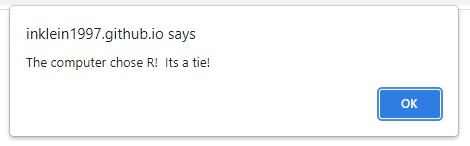
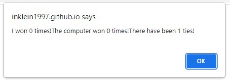
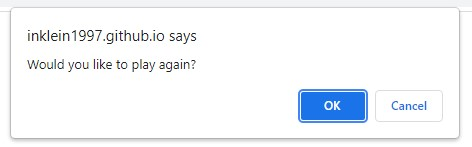

# Rock Paper Scissors Game

## Table of Contents
- [Project Goal](##Project-Goal)
- [Links](##Links)
- [User Instructions](##User-Instructions)
- [Acknowledgements](##Acknowledgements)

## Project Goal
To create an application utilizing only JavaScript that simulates a fair game of "Rock Paper Scissors" against a bot using prompt(), alert(), and confirm() methods.  Bot choice is always random and score is displayed after every round.

## Links
- [URL to Deployed Application](https://inklein1997.github.io/Rock-Paper-Scissors-Activity/)
- [URL to Github Repository](https://github.com/inklein1997/Rock-Paper-Scissors-Activity)

## User Instructions
1. Accept invite to play by clicking **"OK"**  

2. Type **"R"** for Rock, **"S"** for Scissors, and **"P"** for Paper.  Click **"OK"**.  

3. Click **"OK"** after viewing the results. 

4. Click **"OK"** after viewing the scoreboard. 

5. Click **"OK"** after if you would like to play again. 

## Acknowledgements
- Concept for selecting a random element in array was pulled from [MDN Web Docs](https://developer.mozilla.org/en-US/docs/Web/JavaScript/Reference/Global_Objects/Math)

